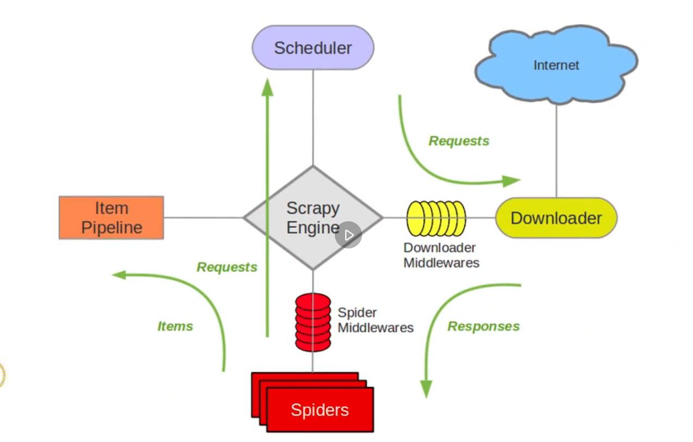
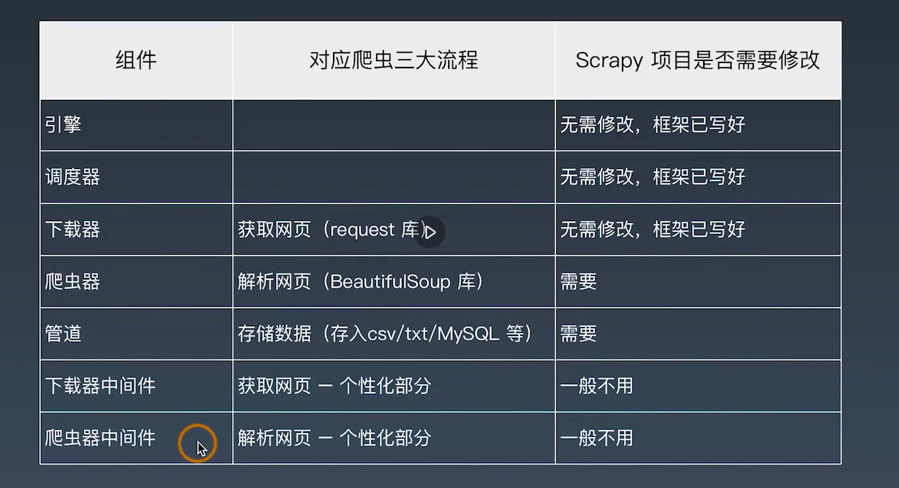

## 学习笔记

## Scrapy

### 核心组件
* Engine: 大脑，指挥其它组件协同工作
* Scheduler: 调度器接受引擎发过来的请求，按照先后顺序，压入队列中，同时除去重复的请求
* Downloader: 下载器用于下载网页内容，并返回给爬虫
* Spiders: 用于从特定的网页中提取需要的信息，即所谓的实体(ITEM)， 用户也可以从中提取链接，让Scrapy继续抓下一个页面
* Item Pipelines：负责处理爬虫从网页中抽取的实体。主要的功能是持久化实体，验证实体的有效性，清除不需要的信息等。
* Downloader Middlewares
* Spider Middlewares




### 安装步骤
* 命令 `pip install scrapy`
```bash
.
├── scrapy.cfg                       # 项目的配置文件
└── spiders                          # 实现爬虫的Python文件
    ├── __init__.py
    ├── __pycache__
    │   ├── __init__.cpython-37.pyc
    │   └── settings.cpython-37.pyc
    ├── items.py                     # 定义所爬取记录的数据结构
    ├── middlewares.py
    ├── pipelines.py                 # 设置保持位置
    ├── settings.py                  # 项目的设置文件
    └── spiders
        ├── __init__.py
        ├── __pycache__
        │   └── __init__.cpython-37.pyc
        └── movies.py

```

### Start A New Scrapy Project
Use project `maoyanmovie` as an example
* Create a new scrapy project:
```bash
$ scrapy startproject maoyanmovie
```
* Create a spider
```bash
$ cd maoyanmovie
$ scrapy genspider maoyan maoyan.com
```
* Run crawl
```bash
$ cd maoyanmovie
$ scrapy crawl maoyan
```

### 感想
在第一周里第一次接触了网络爬虫，并且学习到了两种不同的请求方式: `requests` 和 `scrapy`. requests相对简单直接，需要自己构造http请求 
scrapy提供框架，不需要自己构造http请求，而且提供xpath的支持。 从反爬虫的机制上来说，scrapy远胜requests.
bs的解析方式主要通过find来定位tag，而xpath提供更强大的xpath定位支持，相对易用直接，但是有自己的语法。