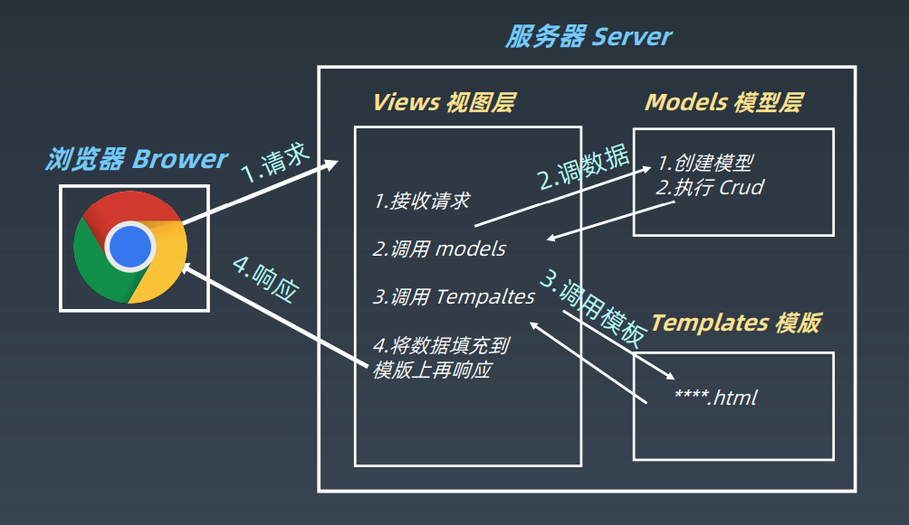

# 学习笔记

## Django

### Django简介
* 开源Web应用框架
* 最初用于管理劳伦斯出版集团旗下的一些以新闻内容为主的网站
* 2005年7月在BSD许可证下发布

### Django框架模式
* MTV: Model-Template-Views


### Django的特点
* MTV框架
* DRY (Do not repeat yourself)
* 组件丰富
  * ORM (对象关系映射)
  * URL支持正则表达式
  * 模版可继承
  * 内置用户认证
  * admin管理系统
  * 内置表单模型， Cache缓存系统，国际化系统
  
### Django版本
* 推荐LTS版本 2.2.13， 但是目前最新的是3.0
```
$ pip install django==2.2.13
```

### 创建Django项目
```
$ django-admin startproject test_proj

$ tree -L 3 test_proj
test_proj
├── manage.py
└── test_proj
    ├── __init__.py
    ├── settings.py
    ├── urls.py
    └── wsgi.py
```
* manage.py做了些什么
1. 解析 manage.py 的 runserver 和 IP 端口参数
2. 找到 command 目录加载 runserver.py
3. 检查 INSTALL_APP、IP 地址、端口、ORM 对象
4. 实例化 wsgiserver
5. 动态创建类并接收用户的请求

### Django的配置文件
* URL调度器 - urls.py 中的urlpatterns: 实现了从URL路由到视图的映射功能， 过程中使用了一个 Python 模块，**URLconf**(URL configuration)，通常这个功能
也被称作 URLconf
* URL支持正则表达式以及变量: str，int，slug，uuid and path

### Django如何处理一个请求
* 如果传入 HttpRequest 对象拥有 urlconf 属性（通过中间件设置），它的值将被用来代替
ROOT_URLCONF 设置
* Django 加载 URLconf 模块并寻找可用的 urlpatterns，Django 依次匹配每个 URL 模式，在与
请求的 URL 匹配的第一个模式停下来
* 一旦有 URL 匹配成功，Djagno 导入并调用相关的视图，视图会获得如下参数：
  * 一个 HttpRequest 实例
  * 一个或多个位置参数提供
* 如果没有 URL 被匹配，或者匹配过程中出现了异常，Django 会调用一个适当的错误处理视图

### Django的View

* objects.all() #选取所有数据
* objects.all().count() #计数
* objects.values('n_star') #某一列数据
* queryset.filter(**condtions).count() #符合条件计数

### Django的快捷函数
* render(): 将给定的模板与给定的上下⽂字典组合在⼀起，并以渲染的⽂本返回⼀个
HttpResponse 对象
* redirect()： 将⼀个 HttpResponseRedirect 返回到传递的参数的适当URL
* get_object_or_404()： 在给定的模型管理器( model manager) 上调⽤ get() ，但它会引发 Http404 ⽽不是
模型的 DoesNotExist 异常

### Django的模型与数据库
* 每个模型都是一个 Python 的类，这些类继承 django.db.models.Model
* 模型类的每个属性都相当于一个数据库的字段
* 利用这些，Django 提供了一个自动生成访问数据库的 API
* 字段: 参考：https://docs.djangoproject.com/zh-hans/2.2/topics/db/models
* 从 Django 到 SQL: `python manage.py migrate`
* 从 SQL 到 DjangoL: `python manage.py inspectdb`

### 为什么要阅读源代码
* 解决文档里没有描述的特定问题
* 二次开发
* 学习语言 -- 代码风格、规范、高级语法
* 学习设计模式 -- 接口、框架、架构
* 学习算法
* 阅读源代码不是唯一的学习手段，也不是最高效的那个